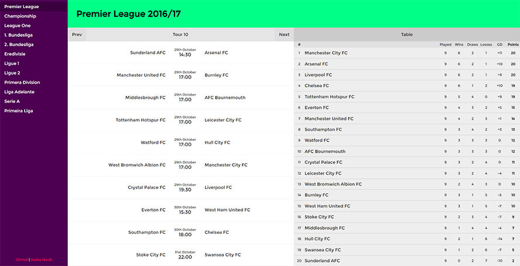

# ng2-football-api

Simple [Angular 2](https://github.com/angular/angular) application using [Angular-CLI](https://github.com/angular/angular-cli) and [football-data.org API](http://api.football-data.org/docs/v1/index.html).

Demo: https://football.nvx.me

## Dev

Local: `ng serve` 

## ToDo

### Features

- [x] Competition page
- [ ] Match page
- [ ] Team page
- [ ] Refresh button
- [ ] Timezone selection/detection
- [ ] "Powered by API"
- [ ] Players
- [ ] Live updates

### Dev

- [ ] Responsive
- [ ] 404
- [ ] Animations and loaders
- [ ] Logos and photos
- [ ] API Cache

### Bugfixes